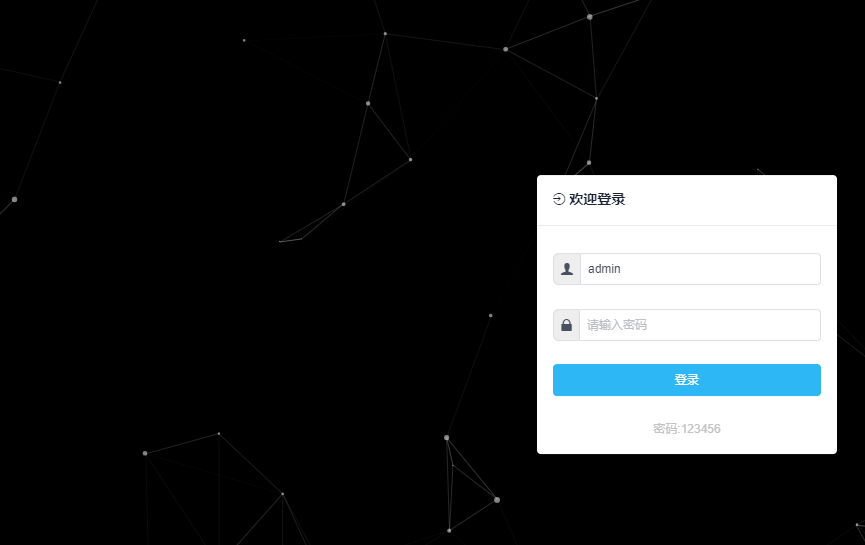
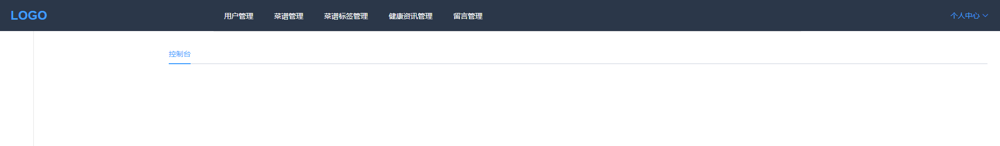

## Version：v0.5
```
本项目特点是，主菜单在头部，初始化是五个主菜单（可以配置），之后菜单则是下拉形式展示。
左侧是该主菜单的自子菜单；选择过的菜单会在标签条中显示，可以更快的进入你上一步的菜单中。

```
## Introduction
```
a simple 'vue iview webpack' admin template
simple build
simple develop
simple change
simple give you
```

## Install
```bush
// install dependencies
yarn install
or
npm install
```
## Run
### Development
```bush
npm run dev
```
### Production(Build) ,and access:http://localhost:9528
```bush
npm run build
```

server {
        listen 80  default_server;
        listen [::]:80 default_server;
        charset UTF-8;

        proxy_set_header        Host            $host;
        proxy_set_header        X-Real-IP       $remote_addr;
        proxy_set_header        X-Forwarded-For $proxy_add_x_forwarded_for;
        root /httx/run/iview;

        index index.html;

        location / {
           try_files $uri $uri/ @rewrites;
        }

        location @rewrites {
           rewrite ^(.+)$ /index.html last;
        }

        location ~* \.(?:ico|css|js|gif|jpe?g|png)$ {
           expires max;
           add_header Pragma public;
           add_header Cache-Control "public, must-revalidate, proxy-revalidate";
        }

  }
```


## 文件结构
```shell
.
├── dist    build 目录
└── src
      ├── api    http调用接口
    ├── assets    图片文件
      ├── components    组件
    ├── router    路由表
     ├── store    全局数据存储
    ├── styles    样式文件
      ├── utils     公共方法
    └── views    视图组件
        ├── dashboard  用户自己展示界面
        ├── layout    模板框架
        └── login     登录
 └── static   引入第三方目录
```


## Display
### login展示
- 默认是登录名和密码是：admin/123456




### home展示
- 仪表盘



